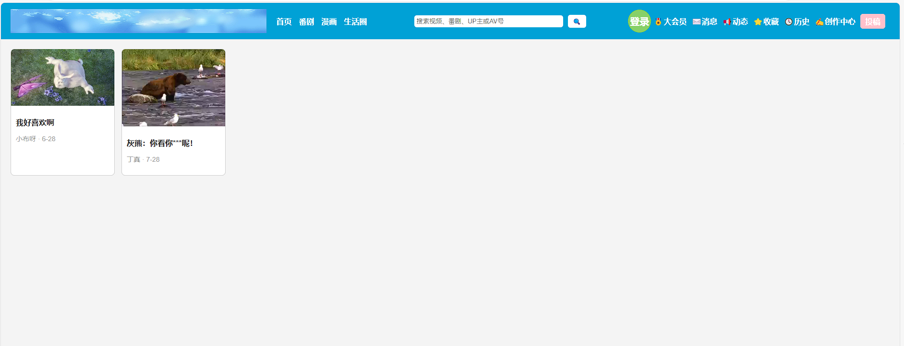
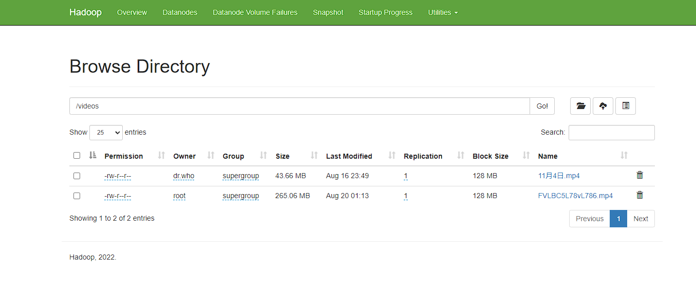

FreeHome文档

----------------------------------------------

目前打算做下面几个功能：

1.首页展示各种视频,有视频详情页，支持评论。

2.番剧展示各种动漫，支持评分和搜索功能。

3.漫画展示各种渠道分享的漫画，用户可以分享自己上传的漫画，支持搜索，评论。

4.生活圈类似微信朋友圈，每个FreeHome用户都可以看到，又有点像微博发帖。

5.做喜好推荐系统。

6.后台视频审核系统

7.后期考虑做App。

最后本系统采用版本 SpringBoot 2.7.18+jdk17

--------------

React学习官网：

新版：https://zh-hans.react.dev/learn

旧版：https://zh-hans.legacy.reactjs.org/docs/getting-started.html

-----------------

使用的UI组件：https://semi.design/zh-CN/start/introduction

-----------

jdk11和jdk17特性：

https://www.zibuyuyy.com/Java11%E5%8F%8AJava17%E6%96%B0%E7%89%B9%E6%80%A7%E4%BD%93%E9%AA%8C%E6%80%BB%E7%BB%93.html

---------

报错：程序包xxx.xxx.xx不存在。

解决：检查好各模块的依赖关系。

项目中没有 .iml文件，用命令 mvn idea:module 去生成

----

Hibenate于Mybatis的对比：

http://lvhongqiang.com/blog426.html

-----

注解使用明细：

```javascript
@Entity注释指名这是一个实体Bean，@Table注释指定了Entity所要映射带数据库表，其中@Table.name()用来指定映射表的表名。
如果缺省@Table注释，系统默认采用类名作为映射表的表名。实体Bean的每个实例代表数据表中的一行数据，行中的一列对应实例中的一个属性。

@Column注释定义了将成员属性映射到关系表中的哪一列和该列的结构信息，属性如下：
1）name：映射的列名。如：映射tbl_user表的name列，可以在name属性的上面或getName方法上面加入；
2）unique：是否唯一；
3）nullable：是否允许为空；
4）length：对于字符型列，length属性指定列的最大字符长度；
5）insertable：是否允许插入；
6）updatetable：是否允许更新；
7）columnDefinition：定义建表时创建此列的DDL；
8）secondaryTable：从表名。如果此列不建在主表上（默认是主表），该属性定义该列所在从表的名字。
@Id注释指定表的主键，它可以有多种生成方式：

1）TABLE：容器指定用底层的数据表确保唯一；
2）SEQUENCE：使用数据库德SEQUENCE列莱保证唯一（Oracle数据库通过序列来生成唯一ID）；
3）IDENTITY：使用数据库的IDENTITY列莱保证唯一；
4）AUTO：由容器挑选一个合适的方式来保证唯一；
5）NONE：容器不负责主键的生成，由程序来完成。

@GeneratedValue注释定义了标识字段生成方式。

@Temporal注释用来指定java.util.Date或java.util.Calender属性与数据库类型date、time或timestamp中的那一种类型进行映射。

@Temporal(value=TemporalType.TIME)
```

--------

hadoop HDFS文件系统

安装参考的帖子：https://blog.csdn.net/qq_34720818/article/details/106793929，https://www.cnblogs.com/binbingg/p/15587082.html

遇到的错误解决办法：https://blog.csdn.net/weixin_43848614/article/details/112596493，https://www.cnblogs.com/shujuyr/p/15174455.html

关闭防火墙：systemctl stop firewalld.service

立马重启docker:  systemctl restart docker


jps命令查看进程

netstat -ntpl | grep xxx

xxx:为jps命令后 NameNode所对应进程号

-----------------------

前端页面：


前端页面启动：

```
npm install  # 回车
npm start # ENTER
```

前端代码：https://github.com/LZZpro/free-home-ui

--------------


HDFS分布式文件系统：



关于：

项目在开发中，项目用了React+SpringCloud+Hibernate+HDFS。后端已经完成了登陆注册和登出接口，文件/视频上传，图片预览等功能，后续还在开发。

本人前端学得不好，乐意接受前端的同学指导。如果有兴趣的同学可以加入我们，不论是小白或者有经验的同学都可以成为项目的开发者，一起交流学习。

二维码过期可以加我微信：LZz3146 (备注来意：自由之家)。


#   F r e e A n i m e H o m e
